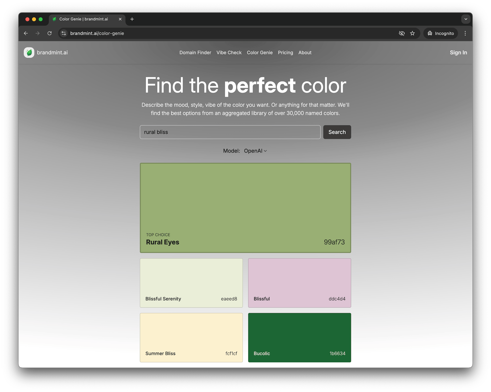

# Build Your Own Color Search Engine
### How to create a semantic search engine for colors (or anything else) using Supabase and an embedding provider such as OpenAI or Mistral

When I saw this [post on Hacker News](https://news.ycombinator.com/item?id=44317291) I was intrigued by the reference to a dataset of 30,000 named colors.

I use colors a lot, and love the ecosystem of color tools out there (examples [one](https://paletton.com/), [two](https://chromavibes.net/), [three](https://tailwindcss.com/docs/colors)). One thing conspicuous by its absence is semantic search for color.

The use case: you're creating some content and you need a color that captures something abstract like "rural bliss" or something ephemeral like "a rainy night in futuristic Tokyo". You can click around on a color wheel or random palette generator, but you want to jump to a starting point that someone else has already put some thought into. You want a _named color_.

I couldn't find any existing semantic search engines specifically for named colors, so I built one:

https://brandmint.ai/color-genie

You can build one too! Or a semantic search engine for anything else you have data on. Here's how:

## Step 0 - Have some source data

For this color search engine the source data is from [this excellent project](https://github.com/meodai/color-names/blob/main/src/colornames.csv), which aggregates named colors from across more than 20 sources, ranging from XKCD to Thai national holidays. Thank you David Aerne (meodai) and team!

This data has a nice and simple structure:

- name string
- hex string
- is_good_name boolean

Good to know.

## Step 1 - Create a PostgreSQL Database to hold the data

Supabase > new project > follow the flow to create a new PostgreSQL

Once it exists, the first thing you'll need to do is add the vector extension. In the SQL Editor: choose New SQL Snippet (Execute SQL Queries)

There are two queries to run here:

```sql
CREATE SCHEMA IF NOT EXISTS extensions;

CREATE EXTENSION IF NOT EXISTS vector WITH SCHEMA extensions;
```


## Step 2 - Create a Table in the Database

Even though you've just added the `extensions` schema to support vectors, the `colors` table itself will live in the `public` schema.

Supabase does have a UI for creating a new Table but it doesn't let you specify vector size, so you'll need to do this with another SQL command.

For our color data we're going to need the following columns:

- id (number is good for us here)
- created_at (timestamp defaulting to now - may be useful later if expanding the list)
- name (unique string - we don't want duplicate names pointing at different colors)
- hex (string)
- is_good_name (boolean defaulting to false)
- embedding_openai_1536 (vector with 1536 dimensions)

Here's the SQL:

```sql
CREATE TABLE public.colors (
    id BIGSERIAL PRIMARY KEY,
    created_at TIMESTAMP WITH TIME ZONE DEFAULT NOW(),
    name TEXT NOT NULL UNIQUE,
    hex TEXT,
    is_good_name BOOLEAN DEFAULT FALSE,
    embedding_openai_1536 VECTOR(1536)
);
```

You may get a security warning about Row Level Security. You can manually enable that on the table after creating it, then click "Add RLS Policy". When choosing a policy, I just used the Templates to enable read access for all users.

## Step 3 - Pull in the data source

Easy route: just copy paste the CSV into your repo and run script from there.

Sidequest: I want to pull in the color list via git so that it's easier to pull in future updates.

To sync first time:

```sh
git remote add canonical-color-list https://github.com/meodai/color-names.git
git fetch canonical-color-list
git checkout canonical-color-list/main -- src/colornames.csv
git add src/colornames.csv
git commit -m "Adding canonical color list from meodai/color-names"
git push origin main
```

To update later:

```sh
git fetch canonical-color-list
git checkout canonical-color-list/main -- src/colornames.csv
git commit -m "Update colornames.csv from meodai color-names"
git push
```

## Step 4 - Connect our codebase to an embedding provider (OpenAI, Mistral etc)

I'm using TypeScript.

First I create a simple client object with OpenAI (Mistral will come later):

```ts
import OpenAI from "openai";

const apiKey = process.env.OPENAI_API_KEY;

if (!apiKey) {
  throw new Error("OPENAI_API_KEY is not set");
}

export const clientOpenai = new OpenAI({ apiKey });
```

Then a function to call it:

```ts
import { clientOpenai } from "./clientOpenai";

const getEmbedding = async (inputText: string) => {
  const embedding = await clientOpenai.embeddings.create({
    model: "text-embedding-3-small",
    input: inputText,
    encoding_format: "float",
  });
  return embedding.data[0].embedding;
};
```

Then a super simple script that calls the function:

```ts
const testRun = async () => {
  const embedding = await getEmbedding("red");
  console.log(embedding);
  console.log(embedding.length);
};

testRun();
```

To run this, I use `bun`. So the Terminal command is:

```sh
bun src/script.ts
```

## Step 5 - Connect our codebase to Supabase

To connect your code with Supabase find your Project ID (find this in `Settings > General > Project Settings`).

It will look something like this: `abcdefghijklmnopqrst`

Your .env file will need a `SUPABASE_URL`, which will be built around the Project ID using this format:

`https://abcdefghijklmnopqrst.supabase.co`

Your `SUPABASE_SERVICE_ROLE_KEY` is a longer string that you'll find in `Settings > API Keys > Reveal`.

Here's the code to create your Supabase client on the server:

```ts
import { createClient } from "@supabase/supabase-js";
import { Database } from "../types/supabase";

const supabaseUrl = process.env.SUPABASE_URL;
const supabaseKey = process.env.SUPABASE_SERVICE_ROLE_KEY;

if (!supabaseUrl || !supabaseKey) {
  throw new Error("SUPABASE_URL or SUPABASE_SERVICE_ROLE_KEY is not set");
}

export const clientSupabase = createClient<Database>(supabaseUrl, supabaseKey);
```

This is my first time using Supabase (historically I used Prisma ORM) so I was thrilled to learn it gives you a clean script for generating a types file.

Here's how to use it. In my case I store the types in `types/supabase.ts` so need to have that `types` folder already created.

1. Install Supabase: `npm i supabase`
2. Login to Supabase CLI: `npx supabase login`
3. Follow the login flow in your browser
4. Generate TypeScript types: `npx supabase gen types typescript --project-id abcdefghijklmnopqrst > types/supabase.ts`

Save that script as a comment in your .env file, you will use it a ton!

## Step 6 - Define what DB-ready data looks like

Our `types/supabase.ts` file makes it nice and clear what shape our data needs to be in, so let's write a function that can write a row of data into our database, and use that to clearly define the state we need to get our data into. For example this approach lets us learn that the vector must be passed in as a string, which would not be otherwise obvious.

So our target state is:

```ts
type PreppedColor = {
  name: string;
  hex: string;
  is_good_name: boolean;
  embedding_openai_1536: string;
};
```

And our write function is:

```ts
const saveColorEntry = async (preppedColor: PreppedColor) => {
  const { error } = await clientSupabase
    .from("colors")
    .upsert(preppedColor, { onConflict: "name" });
  if (error) {
    console.error(error);
  } else {
    console.log("Saved color entry", preppedColor.name);
  }
};
```

Having uniqueness enforced on the `name` column is handy here, it means we can upsert and use the `name` column to spot if we're accidentally running the script over the same data twice.

## Step 7 - Write function to transform source data into DB-ready data

So I needed to transform data that looks like this:

```csv
name,hex,good name
100 Mph,#c93f38,x
18th Century Green,#a59344,
1975 Earth Red,#7b463b,
1989 Miami Hotline,#dd3366,
```

into this:

```ts
{
  name: "100 Mph";
  hex: "c93f38";
  is_good_name: true;
  embedding_openai_1536: "[-0.022126757,-0.010959357,-0.0027992798,0.019125007,0.017044587,...]";
}
```

Some notes on how I approached this:

- My functions sequence was `getColorRows -> readColorRow -> prepColorEntry -> saveColorEntry`
- I chose to strip out the hash character from the hex color values, that's a personal preference
- I added a time delay just in case of rate limiting

The result is a simple "ETL" script, it lets you `Extract Transform Load` data from one place to another.

ETL scripts are very project-specific. If you are following guide this literally to build a color search engine with the same data source, you can see how I wrote these functions [here](https://github.com/yablochko8/color-finder-semantic-search/blob/main/src/script.ts).

## Step 8 - Save our first few colors to the database

At this point I ran my ETL script with `maxRows = 50` just to have something to test against.

## Step 9 - Add a Vector Index to the Database

The command you will want to run looks something like this:

```sql
CREATE INDEX CONCURRENTLY embedding_openai_1536_ip_lists_30_idx
    ON public.colors
    USING ivfflat (embedding_openai_1536 vector_ip_ops)
    WITH (lists = 30);
```

As far as I can tell the index name is never again touched by humans unless they're viewing a list of indices, so make it as long and specific as you like.

Let's explain the other parameter choices:

**ivfflat** = An index method optimized for high-dimensional vector data. It divides vectors into clusters for faster searching. The alternative would be `hnsw` (Hierarchical Navigable Small World) which can be faster but uses more memory.

**vector_ip_ops** aka internal product = Fast way to compare vectors that can only be used in conjunction with certain embedding models, those that have been unit normalised. Alternatives are `vector_l2_ops` (Euclidean distance) and `vector_cosine_ops` (cosine similarity). Thank you to Chris Loy for helping me out here, he wrote a good [explainer post](https://chrisloy.dev/post/2025/06/30/distance-metrics) that goes through the different options.

**lists** = Number of clusters to divide the vectors into. Generally: More lists give faster search but lower accuracy.

Microsoft gives the following [advice for tuning ivfflat](https://learn.microsoft.com/en-us/azure/cosmos-db/postgresql/howto-optimize-performance-pgvector):

1. Use lists equal to rows / 1000 for tables with up to 1 million rows and sqrt(rows) for larger datasets.
2. For probes start with lists / 10 for tables up to 1 million rows and sqrt(lists) for larger datasets.

So for 30,000 entires, that gives lists = 30, probes = 3. We'll use the probes value later.

⚠️ **Potential Gotcha: Working Memory Limits** ⚠️

You may hit the same problem I hit, which was that the working memory needed is higher than the default Supabase limits, and can't be increased via the interface! This is because the `SET maintenance_work_mem = '128MB';` command can't run inside a transaction block.

The workaround was to connect to the database via Terminal.

If you haven't done this before you'll need to install Postgres on your machine. For macOS using brew the command is:

```sh
brew install postgresql
```

Then connect in to the database with this command:

```sh
psql "host=aws-0-us-east-2.pooler.supabase.com dbname=postgres user=postgres.abcdefghijklmnopqrst"
```

Where...

- `us-east-2` is the datacentre you chose when setting up your project
- `abcdefghijklmnopqrst` is your Project Id
- you'll be prompted for a password, it's the password you gave when you first set up the database

I needed this psql command a few times and found it useful to store in .env for easy copy and paste, alongside the `npx supabase gen types` command.

Once connected to the database by command line, I was able to run this code.

```sql
SET maintenance_work_mem = '128MB';

CREATE INDEX CONCURRENTLY embedding_openai_1536_ip_lists_30_idx
    ON public.colors
    USING ivfflat (embedding_openai_1536 vector_ip_ops)
    WITH (lists = 30);
```

## Step 10 - Create an RPC Function to call that Vector Index from code

Usually when you want to call this DB from code you'll use the supabase SDK, and that will have predefined functions to let you add, delete, update etc.

Calling the vector index is beyond the scope of the current Supabase SDK, so we'll need to create our own custom function that we can call in a controlled way.

This is called an RPC (Remote Procedure Call) Function.

For our needs, we're going to want to query the embedding column, and get results back with `name`, `hex`, and `is_good_name` fields. We don't need to specify the index we're calling, as there should be only one for that column.

Here's the code for creating the index:

```sql
CREATE OR REPLACE FUNCTION search_embedding_openai_1536(
    query_embedding VECTOR(1536),
    match_count INT DEFAULT 10
)
RETURNS TABLE (
    name TEXT,
    hex TEXT,
    is_good_name BOOLEAN,
    distance FLOAT
)
LANGUAGE sql VOLATILE
AS $$
    SET ivfflat.probes = 3;

    SELECT
        c.name,
        c.hex,
        c.is_good_name,
        c.embedding_openai_1536 <#> query_embedding AS distance
    FROM (
        SELECT *
        FROM colors
        ORDER BY embedding_openai_1536 <#> query_embedding
        LIMIT match_count
    ) c;
$$;
```

Some explanations:

`ivfflat probes` - This sets how many IVF lists the index will scan during search. Higher values give more accurate results but slower queries.

`language sql volatile` - This tells Postgres that this is a SQL function that can modify data and its output may change even with the same inputs. 'volatile' means the function's result can vary even if called with identical parameters. This is required if we want to use a non-default number of ivfflat probes.

`SELECT *` as c then `SELECT c.name, c.hex`... - More on this choice further down under "Side Quest - Solving Timeouts"

## Step 11 - Run a Test Query

At this stage I only have 50 entries in the database, but that's enough to test against.

```ts
const testQuery = async () => {
  const testEmbedding = await getEmbedding("very fast car");
  const { data, error } = await clientSupabase.rpc(
    "search_embedding_openai_1536",
    {
      query_embedding: JSON.stringify(testEmbedding),
      match_count: 10,
    }
  );
};
```

Sure enough, a wuery for "very fast car" gives us the named color "100 Mph", a speedy red #c93f38. Success!

## Step 12 - Add in all the data

At this point I added in all 30,355 entries. This took about 8 hours because I was too impatient to add in batching at the beginning.

- 🟢 Good news: It cost me only $0.02 of API costs for the embedding values.
- 🔴 Bad news: It pushed me over the database size limits on Supabase...

## Step 13 - Upgrade Supabase

30k entries with vectors plus an index plus RPC function results in a database size of 0.53 GB, and the free tier limit is 0.5 GB.

If I had known this I might have only used a subset of the data, but I didn't so I've moved up to Pro plan size.

## Step 14 - Integrate with Frontend

In my case that's https://brandmint.ai/color-genie

The server code matches the pattern of a testQuery above.




Remember to add the hashtag back in to the color hex value before passing it to as a style parameter, and you're good to go!

## Side Quest A - Solving Timeouts

At one point I started getting timeout errors:

```json
RPC error: {
code: "57014",
details: null,
hint: null,
message: "canceling statement due to statement timeout",
}
```

It turned out these were caused by the structure of the RPC function.

SLOW version (15,000ms):

```sql
SELECT
    name,
    hex,
    is_good_name,
    embedding_openai_1536 <#> query_embedding AS distance
FROM colors
ORDER BY distance
LIMIT match_count;
```

FAST version (150ms):

```sql
SELECT
    c.name,
    c.hex,
    c.is_good_name,
    c.embedding_openai_1536 <#> query_embedding AS distance
FROM (
    SELECT *
    FROM colors
    ORDER BY embedding_openai_1536 <#> query_embedding
    LIMIT match_count
) c;
```

Intuitively it looks the second one is faster because it's avoiding the columns being unpacked in the ordering calculation, but I don't know enough about PostgreSQL to be sure. I'm just happy I found my way past it.

Before narrowing down on the actual cause of the latency, here are other things I tried that might be useful to others:

- Run ANALYZE (command is just `ANALYZE public.colors`): PostgreSQL scans a sample of rows in the `public.colors` table and updates its internal statistics about the data. These stats help the query planner decide how to execute queries efficiently — for example, whether to use an index or not. This is a once-off function.
- Decreased the number of IVFFLAT probes. In IVFFlat indexing, a higher probes value makes queries slower but more accurate.
- Increased the timeout time in the RPC function (`set statement_timeout = 15000;`). Aka cheating. When I bumped the timeout to 30000ms all my queries got a response, but this was too long for my use case.
- Recreated the index with a higher `lists` value (this only works if your querying with a `probes` that is much lower than the index's number of `lists`)
- Added a catch-and-retry in my server code. The second request always seems to be faster so there must be some warm-up logic or internal caching happening on Supabase

## Side Quest B - Swapping out OpenAI for Mistral

This felt like a nice opportunity to test a Mistral product side-by-side with OpenAI.

Mistral only have one embedding option with size 1024, smaller than OpenAI's smallest option. For a dataset with very short entries this is great news. My workflow was a speed-run of everything before:

1. Added `embedding_mistral_1024 vector(1024)` column to my `colors` table
2. Wrote an [addMistral.ts](https://github.com/yablochko8/color-finder-semantic-search/blob/main/src/extras/addMistral.ts) script to update all my entries. This time I did include batching, so it was completed in under an hour.
3. Created a new index `embedding_mistral_1024_ip_lists_30_idx`
4. Created a new RPC `search_embedding_mistral_1024`
5. Ran the `npx supabase gen types ...` script in my server code so IntelliSense can see the new option
6. Added mistral as an option all the way through to the user frontend

I'm logging the duration times for embedding and retrieval across both OpenAI and Mistral. I'll add that in here when I have more data.

## Other notes

- I've shown the happy path here, perhaps 4 hours of human time. I would estimate there was another 8 hours of active time spent on deadends and debugging.
- Writing this cookbook as I was working through this task made it much easier to jump back in after a one day gap when my focus was elsewhere.
- Embedding costs for this project were trivial. 30k entries came in under $0.02 for both OpenAI and Mistral

## Links

### Embedding Models

- OpenAI https://platform.openai.com/docs/models/text-embedding-3-small
- Mistral https://docs.mistral.ai/capabilities/embeddings/overview/

### More Reading

- Distance Metrics https://chrisloy.dev/post/2025/06/30/distance-metrics
- Semantic Search https://supabase.com/docs/guides/ai/semantic-search

### Try It Out

If you just want to search for colors, jump over to the [Color Genie on brandmint.ai](https://brandmint.ai/color-genie)
